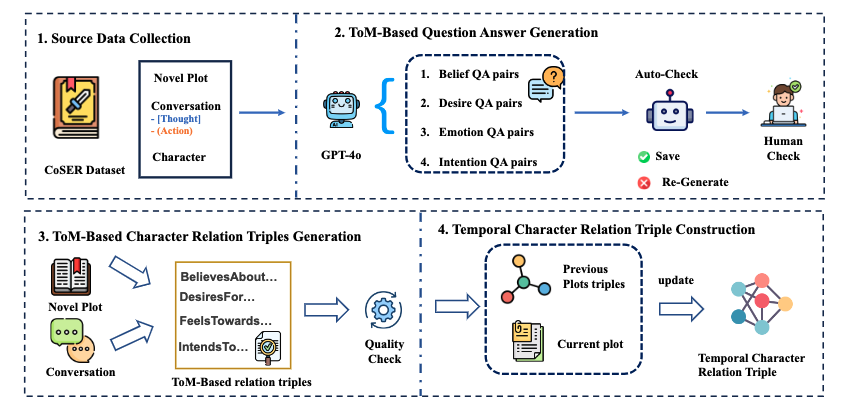

# EvolvTrip: Enhancing Literary Character Understanding with Temporal Theory-of-Mind Graphs

This repository contains the dataset, code, and resources for the paper **"EvolvTrip: Enhancing Literary Character Understanding with Temporal Theory-of-Mind Graphs"**.

Our work introduces **LitCharToM**, a character-centric benchmark for evaluating Theory-of-Mind (ToM) reasoning in Large Language Models (LLMs) using classic literature. We also propose **EvolvTrip**, a neuro-symbolic approach that enhances LLM performance by representing characters' evolving mental states as structured knowledge.

## Framework Overview


*Figure 1: Our ToM-based character understanding pipeline: (1) Source data collection from CoSER Dataset including novel plots and character conversations with [Thought] and (Action) annotations, (2) GPT-4o generation of belief, desire, emotion, and intention QA pairs with two-stage verification, (3) Extraction of BelievesAbout, DesiresFor, FeelsTowards, and IntendsTo relation triples, and (4) Temporal knowledge graph construction by integrating previous and current plot information.*

## The LitCharToM Dataset Structure

The dataset is built from classic literary works and is designed to test a model's ability to comprehend character psychology across four dimensions: belief, emotion, intention, and desire. Each data point is structured around a specific plot involving key characters.

Here is one example from the dataset:

### 1. Plot & Character

Each entry begins with a summary of the narrative plot and identifies the target character whose mental state is being analyzed.

**JSON Format:**
```json
{
    "book_name": "King Lear",
    "character": "King Lear",
    "plot_index": 6,
    "plot_summary": "King Lear decides to divide his kingdom among his three daughters based on their professions of love. Cordelia, refusing to flatter, is disinherited. Kent is banished for defending her. Lear gives his power to Goneril and Regan, who soon begin to undermine his authority. The Fool criticizes Lear's actions, and Lear starts to realize his mistake. Goneril demands Lear reduce his retinue, leading to a heated confrontation. Lear decides to leave for Regan's castle."
}
```

**Character Description (Inferred from Plot & Triples):**
You are King Lear, an aging monarch accustomed to absolute power and flattery. You are orchestrating a public spectacle to divide your kingdom, making your daughters' inheritance contingent on their declarations of love. Your sense of self is deeply tied to their performance, and you expect your favorite daughter, Cordelia, to profess her love most eloquently. You are proud and quick to rage, perceiving any deviation from your expectations—such as honest simplicity—as betrayal and defiance. Your actions are driven by a need for affirmation and a desire to maintain control even as you relinquish it.

### 2. Scenario

The specific scene provides the immediate context for the character's actions and mental states.

```json
{
  "scenario": "The royal court is assembled in a grand hall, filled with tension and anticipation. Ornate tapestries and gilded decorations surround the throne where King Lear sits, preparing to divide his kingdom. Goneril and Regan have already delivered their exaggerated declarations of love, receiving large portions of the kingdom. Now, all eyes are on Cordelia, the youngest daughter, as she prepares to speak. The atmosphere is charged with expectation, silence hanging heavy as courtiers watch the pivotal moment that will determine the future of the kingdom."
}
```

### 3. ToM-based Relation Triples

A core component of the **EvolvTrip** framework is the extraction of a character's mental state into structured triples. These triples capture the character's psychology (beliefs, intentions, feelings, desires) at a specific point in the narrative. They serve as structured knowledge to enhance an LLM's reasoning.

```json
{
  "triples": {
    "Target Character": [
      "(King Lear, DesiresToHear, Cordelia's profession of love)",
      "(King Lear, BelievesAboutCordelia, Cordelia's profession of love will outshine her sisters')",
      "(King Lear, IntendsTo, divide the kingdom based on daughters' professions of love)",
      "(King Lear, FeelsTowardsCordelia, disbelief and shock at Cordelia's refusal to flatter King Lear)",
      "(King Lear, Desires, affirmation and verbal assurance of love from Cordelia)",
      "(King Lear, FeelsTowardsCordelia, rising anger and overwhelming rage due to perceived betrayal)",
      "(King Lear, IntendsTo, disown Cordelia and strip her of inheritance due to her refusal to flatter King Lear)"
    ]
  }
}
```

### 4. ToM-based QA Pairs

The **LitCharToM** benchmark uses multiple-choice questions to evaluate a model's understanding of the character's internal state. Each question targets one of the four ToM dimensions.

Here is an example of a "Belief" question:
```json
{
  "Belief Multiple Choice Question": {
    "Scenario": "King Lear is shocked by Cordelia's refusal to flatter him.",
    "Reasoning": "Lear believes that Cordelia, his favorite daughter, would express her love in a way that surpasses her sisters'. Her refusal challenges his belief about her loyalty and affection.",
    "Question": "What does King Lear believe about Cordelia's profession of love?",
    "Options": [
      "A. He believes she is jesting and will eventually flatter him.",
      "B. He believes she is being honest and true to herself.",
      "C. He believes she is intentionally defying him out of spite.",
      "D. He believes she is confused and doesn't understand the situation."
    ],
    "Correct Answer": "A"
  }
}
```

## Evaluation Prompt Example

This shows how the dataset components are assembled into a prompt for evaluating an LLM. The `EvolvTrip-enhanced` version includes the structured triples to aid the model's reasoning process.

**Input:**
```
You are an expert in narrative analysis and character psychology. Analyze the mental state of the character based on the following context and answer the question.

STORY PLOT:
King Lear decides to divide his kingdom among his three daughters based on their professions of love. Cordelia, refusing to flatter, is disinherited... Lear decides to leave for Regan's castle.

SCENARIO:
The royal court is assembled in a grand hall, filled with tension and anticipation... Now, all eyes are on Cordelia, the youngest daughter, as she prepares to speak.

[Optional for EvolvTrip-enhanced prompting]
RELEVANT MENTAL STATE TRIPLES:
(King Lear, DesiresToHear, Cordelia's profession of love)
(King Lear, BelievesAboutCordelia, Cordelia's profession of love will outshine her sisters')
(King Lear, FeelsTowardsCordelia, disbelief and shock at Cordelia's refusal to flatter King Lear)

QUESTION:
What does King Lear believe about Cordelia's profession of love?

CANDIDATE CHOICES:
A. He believes she is jesting and will eventually flatter him.
B. He believes she is being honest and true to herself.
C. He believes she is intentionally defying him out of spite.
D. He believes she is confused and doesn't understand the situation.
```

**Output:**
```
Answer: A
```

## Citation

If you find our work helpful, please cite our paper:

```bibtex
@article{yang2024evolvtrip,
  title={EvolvTrip: Enhancing Literary Character Understanding with Temporal Theory-of-Mind Graphs},
  author={Yang, Bohao and Xu, Hainiu and Du, Jinhua and Li, Ze and He, Yulan and Lin, Chenghua},
  journal={arXiv preprint},
  year={2025}
}
```
